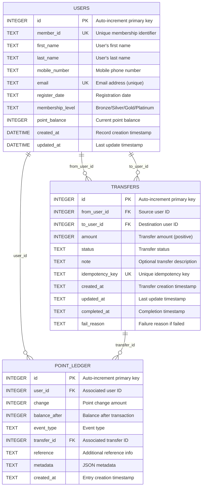

# Database ER Diagram

## Entity Relationship Diagram

## Entity Descriptions

### USERS
• **Primary Key**: `id` (Auto-increment)
• **Unique Constraints**: `member_id`, `email`
• **Purpose**: Stores user information and current point balance
• **Key Fields**:
  ◦ `point_balance`: Current point balance
  ◦ `membership_level`: User tier (Bronze, Silver, Gold, Platinum)
  ◦ `member_id`: Unique membership identifier (LBK format)
  ◦ `register_date`: Date when user joined the membership program
• **Default Values**:
  ◦ `membership_level`: 'Bronze' (default for new users)
  ◦ `point_balance`: 0 (default starting balance)

### TRANSFERS
• **Primary Key**: `id` (Auto-increment)
• **Unique Constraints**: `idempotency_key`
• **Foreign Keys**:
  ◦ `from_user_id` → `users.id`
  ◦ `to_user_id` → `users.id`
• **Purpose**: Records point transfer transactions between users
• **Status Values**:
  ◦ `pending`: Transfer initiated
  ◦ `processing`: Transfer being processed
  ◦ `completed`: Transfer successful
  ◦ `failed`: Transfer failed
  ◦ `cancelled`: Transfer cancelled
  ◦ `reversed`: Transfer reversed
• **Constraints**:
  ◦ `amount > 0`: Only positive amounts allowed
  ◦ `idempotency_key`: Prevents duplicate transfers
  ◦ `from_user_id ≠ to_user_id`: Self-transfers not allowed

### POINT_LEDGER
• **Primary Key**: `id` (Auto-increment)
• **Foreign Keys**:
  ◦ `user_id` → `users.id`
  ◦ `transfer_id` → `transfers.id` (nullable)
• **Purpose**: Audit trail for all point changes
• **Event Types**:
  ◦ `transfer_out`: Points deducted for outgoing transfer
  ◦ `transfer_in`: Points added from incoming transfer
  ◦ `adjust`: Manual point adjustment
  ◦ `earn`: Points earned from activities
  ◦ `redeem`: Points redeemed for rewards
• **Key Fields**:
  ◦ `change`: Point change amount (positive or negative)
  ◦ `balance_after`: User's point balance after this transaction
  ◦ `metadata`: Additional transaction data (JSON format)
  ◦ `reference`: Human-readable transaction description

## Relationships

1. **User to Transfers (One-to-Many)**
   ◦ A user can have multiple outgoing transfers (`from_user_id`)
   ◦ A user can have multiple incoming transfers (`to_user_id`)
   ◦ Each transfer must have valid sender and receiver users

2. **User to Point Ledger (One-to-Many)**
   ◦ Each user has multiple ledger entries tracking their point history
   ◦ Every point change must be recorded in the ledger
   ◦ Ledger provides complete audit trail for user's point activities

3. **Transfer to Point Ledger (One-to-Many)**
   ◦ Each transfer creates multiple ledger entries (one for sender, one for receiver)
   ◦ Transfer ID can be null for non-transfer related point changes
   ◦ Enables tracking of which transfers affected which ledger entries

## Indexes

### User Table Indexes
• **Primary Index**: `id` (primary key, automatic)
• **Unique Index**: `member_id` (unique constraint)
• **Unique Index**: `email` (unique constraint, if not null)

### Transfer Indexes
• `idx_transfers_from`: On `from_user_id` for faster user transfer queries
• `idx_transfers_to`: On `to_user_id` for faster user transfer queries  
• `idx_transfers_created`: On `created_at` for chronological sorting
• **Unique Index**: `idempotency_key` for duplicate prevention

### Point Ledger Indexes
• `idx_ledger_user`: On `user_id` for faster user ledger queries
• `idx_ledger_transfer`: On `transfer_id` for transfer-related ledger entries
• `idx_ledger_created`: On `created_at` for chronological sorting

## Business Rules

1. **Point Transfer Rules**:
   ◦ Users cannot transfer to themselves (`from_user_id ≠ to_user_id`)
   ◦ Transfer amount must be positive (`amount > 0`)
   ◦ Sender must have sufficient points (`sender.point_balance >= amount`)
   ◦ Each transfer must have a unique idempotency key
   ◦ Both sender and receiver must exist and be valid users

2. **Point Ledger Rules**:
   ◦ Every point change must be recorded in the ledger
   ◦ Balance after must be calculated correctly (`balance_after = previous_balance + change`)
   ◦ Transfer-related entries must reference the transfer ID
   ◦ Event types must be valid enumerated values

3. **Data Integrity**:
   ◦ Email addresses must be unique (if provided)
   ◦ Member IDs must be unique across all users
   ◦ Foreign key constraints ensure referential integrity
   ◦ Check constraints validate status and event type values
   ◦ Point balances cannot be negative after transactions

4. **Transaction Atomicity**:
   ◦ Point transfers are atomic operations (all-or-nothing)
   ◦ If any part of a transfer fails, the entire transaction is rolled back
   ◦ Concurrent transfers are handled with proper locking mechanisms
   ◦ Idempotency keys prevent duplicate transfer processing

## Database Schema Migration

### Version 1.0 - Initial Schema
- Created `users` table with basic membership information
- Established primary keys and unique constraints

### Version 2.0 - Transfer System
- Added `transfers` table for point transfer functionality
- Added `point_ledger` table for audit trail
- Created foreign key relationships
- Added indexes for performance optimization
- Implemented check constraints for data validation

### Version 2.1 - Enhanced Features
- Added `idempotency_key` for reliable transfer operations
- Enhanced status tracking with additional states
- Added metadata field for extensible transaction information
- Optimized indexes for common query patterns

## Performance Considerations

1. **Query Optimization**:
   ◦ Indexes on frequently queried columns (`user_id`, `created_at`)
   ◦ Composite indexes for complex query patterns
   ◦ Pagination support to handle large datasets

2. **Data Access Patterns**:
   ◦ User balance lookups (frequent): Indexed by user ID
   ◦ Transfer history queries (frequent): Indexed by user ID and creation date  
   ◦ Audit trail lookups (occasional): Indexed by transfer ID

3. **Scalability**:
   ◦ Partitioning strategies for large ledger tables
   ◦ Archive old transfer records to maintain performance
   ◦ Consider read replicas for reporting queries